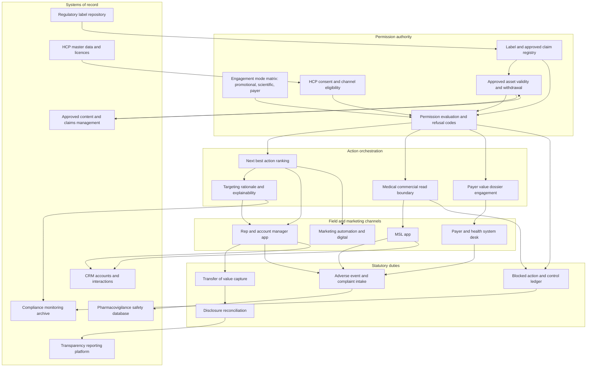

# Onlabel

**Source:** `ai-in-health/Accenture-Intelligent-Commercial-Solution-Life-Sciences/`
**Domain:** `ai-health`
**One-liner:** A next-best-action engine for life-sciences field teams in which no action reaches a rep until its claim set, approved asset, local label version, engagement mode, HCP consent and transparency obligation are all valid in that prescriber's jurisdiction — so commercial AI produces executable calls instead of compliance rework.
**Wedge:** Specialty and rare-disease brands in their first eighteen months post-launch at a top-20 pharma or a first-launch biotech, running 50–500 field representatives plus medical science liaisons across three to ten country affiliates — the launch density the source's AstraZeneca quote describes, where each additional indication multiplies medical-legal-regulatory review load faster than it grows headcount.
**Positioning:** Compliance-gated commercial orchestration for life sciences. CRM records what happened and marketing automation sends what was scheduled; neither knows whether a proposed action is *permitted right now*. Onlabel makes the executability of an action a computed, versioned, jurisdiction-aware object — label version, approved asset and expiry, claim-to-reference mapping, engagement mode, consent, disclosure duty — and refuses with a named reason routed to whoever can unblock it, rather than letting the rep discover the problem in front of a prescriber.

## Market research synthesis

### Thesis from source

The source argues that the commercial model itself, not its execution, is obsolete. Its opening claim is that "today's digitally-enabled, patient outcome-based world, with more specialized drugs, demands very different commercial models than the salesforce dominated models that were prevalent during the blockbuster era." Its Past-versus-Future diagram makes the shift concrete: previously life sciences products were sold into physicians, full stop; in the future the target is patient and economic outcomes, reached simultaneously through physicians, payers, health systems, governments and services. The stated objective is the "quadruple aim" — improved patient care, improved population health, lowered per capita costs, and improved financial performance — which is a claim that a pharmaceutical commercial organisation should now be measured on health-system economics rather than share of voice.

The delivery evidence is specific. Accenture reports improved brand performance by 2–5 percent at more than 140 top brands, digital enablement of over 50 brands worldwide, improved patient care for more than 20,000 patients, over 100,000 sales representatives and medical science liaisons enabled to deliver a targeted customer experience, and 15–30 percent cost savings in marketing at six of the top ten pharmaceutical companies. The practice spans four service lines — Intelligent Access and Launch Solutions to optimise product value propositions and grow revenues, Intelligent Patient Solutions to transform customer and patient engagement for measurable health and economic outcomes, Intelligent Marketing Solutions for experiences across channels and stakeholders, and Insight-Driven Solutions to measure and improve marketing and sales impact on patient health and financial performance. Scale figures: commercial work in 27 countries across five continents, engagement with the sales and marketing functions of all of the top 15 Fortune 500 pharmaceutical companies, 250-plus licensed medical professionals across all major therapeutic areas, and 1,500-plus digital specialists with 5,000 combined years of experience. The technology alliances named — Adobe, Aprimo/Teradata, Microsoft, Oracle, Pega, Salesforce and Veeva — describe the executing stack.

The asymmetry between two of those figures is the commercial tell. Brand performance improves 2–5 percent; marketing costs fall 15–30 percent. When the efficiency gain is five to ten times the effectiveness gain, the binding constraint is not the quality of the targeting model — it is the throughput of the machinery around it. The AstraZeneca quote names that pressure directly: "right now we're in the enviable position of potentially launching 10 new products over the next 5 years. In the past that would have put a tremendous pressure on our resources." Ten launches across a 27-country footprint does not primarily multiply sales calls. It multiplies *approvals*: each claim reviewed by medical, legal and regulatory in each market against each locally approved label; each interaction logged against transparency-reporting obligations; each medical science liaison exchange kept demonstrably clear of promotional intent; each digital touch checked against per-country consent rules. The stack in the alliance list can execute at that volume and has no shared notion of whether a given action is currently allowed.

The Boston Scientific quote points at the other structural change. It describes a digital health platform built to help providers "standardize care, reduce overall length of stay and lower admission rates" and to create "more informed relationships" between healthcare professionals and patients. That is a commercial engagement whose unit of value is a health-system operating metric rather than a prescription — which means the content is economic evidence, not promotion, and the audience is a payer or a value-analysis committee, not a prescriber. A life-sciences commercial system therefore has to carry at least three engagement modes under genuinely different rules: promotional detailing to prescribers, scientific exchange by MSLs responding to unsolicited requests, and evidence-based value dossiers to payers and health systems. Collapsing them into a single omnichannel next-best-action queue is the route to a consent decree, not to the quadruple aim. The defensible product treats the *permission state* of an action as its primary object, recomputed continuously, so what arrives on a rep's phone is exactly the set of things that can be done today.

### Buyer & economic model

- **Primary buyer:** Chief Commercial Officer or VP of Commercial Excellence and Operations at a top-20 pharma, or the commercial lead at a specialty biotech approaching first launch. The Chief Compliance Officer co-signs and holds veto — no commercial system ships past them.
- **Users:** field sales representatives and specialty account managers (daily), medical science liaisons (daily, under separate rules), field reimbursement managers, market access and payer account directors (weekly), brand and omnichannel marketers (campaign planning), medical, legal and regulatory reviewers (review queue), local affiliate commercial leads (market activation), transparency reporting analysts (disclosure cycles), compliance monitoring officers and internal audit (surveillance).
- **Budget owner / value metric:** the brand commercial budget plus field-force operating cost. The value metric is **share of suggested actions executed without compliance rework**, paired with approved-asset utilisation. Secondary metrics are marketing cost per engaged HCP — against the 15–30 percent saving the source claims — the days from claim delta to market-ready asset, and brand performance lift on the 2–5 percent order the source reports.
- **Competing status quo:** a CRM for call logging, a separate approved-content vault for assets, a suggested-action module scoring prescribers on decile and channel affinity with no permission awareness, an MLR workflow in a document management system measured in weeks, transparency spend reconstructed from rep expense reports, and compliance auditing a sample of calls after the fact. Reps close the gap themselves, by using a lapsed detail aid or by having the conversation and logging it vaguely, which is precisely the exposure the system is supposed to remove.

### Domain constraints

- **Regulatory / trust / safety:** promotion of unapproved indications is prohibited, and the boundary is label- and jurisdiction-specific, which makes "on-label" a computed property of an action rather than an attribute of a message. Promotional material requires medical, legal and regulatory review before use, with approvals that expire and claims bound to named references; using a lapsed asset is a finding on its own. Transfers of value to healthcare professionals must be disclosed — Open Payments under the US Sunshine Act, EFPIA disclosure codes across Europe, and local equivalents throughout the source's 27-country footprint — so meals, honoraria, travel and materials must be captured at the interaction with the correct recipient and jurisdiction. Medical affairs must remain separated from commercial: MSLs respond to unsolicited requests through scientific exchange, and their activity cannot be recycled as promotional targeting signal. Any interaction can surface adverse event or product complaint information, creating a pharmacovigilance duty on a regulatory clock regardless of whether the conversation was commercial. Companies operating under a Corporate Integrity Agreement owe monitoring evidence contractually, not just as good practice.
- **Data sensitivity:** HCP data is personal data under GDPR, and in many markets unsolicited digital promotion has no legitimate-interest workaround, so channel eligibility is per-HCP and per-country rather than global. Licensed prescribing and claims data carries contractual restrictions on use, combination and redistribution that survive into any derived model. Patient-level data from patient support programmes must never enter the commercial targeting path — this is a standing enforcement theme, not a hypothetical — and MSL interaction content must be invisible to commercial identities even in archive.
- **Change-management realities:** reps abandon suggestion engines that produce actions they cannot execute, and one refused detail aid in front of a key opinion leader will cost a territory's adoption. MLR reviewers are the true bottleneck and will resist anything that lengthens their queue, so the system has to reduce review volume through claim reuse and surface only genuine deltas. Local affiliates guard their market approvals and will not tolerate a globally produced asset going live without their recorded sign-off. And compliance will not accept a targeting model whose rationale cannot be restated in business language to a monitor.

## Business requirements

- BR-1: No action may be surfaced to a field user unless every gate is currently satisfied — approved asset within validity, claim set on-label for that market's label version, engagement mode permitted for the user's role, HCP channel consent in force, and transparency obligation computable — and a failed gate must return a named reason rather than silently dropping the action.
- BR-2: Promotional content must never carry a claim outside the locally approved label for the HCP's jurisdiction, and publication of a new label version must automatically withdraw every affected asset and queued action in that market the same day.
- BR-3: Medical affairs and commercial activity must be separated by an enforced read boundary: scientific-exchange records may not inform promotional targeting, and the platform must be able to evidence that separation to an external monitor.
- BR-4: Every transfer of value arising from an interaction must be captured at the point of interaction with recipient, amount, category and jurisdiction, and must reconcile to the statutory disclosure submission without manual rework.
- BR-5: Any adverse event or product complaint mentioned in any interaction — promotional, medical or payer — must be capturable in the same flow and routed to pharmacovigilance inside the regulatory clock, and the interaction must not close until routing is confirmed.
- BR-6: MLR review load per launched indication must fall through reuse of already-approved claims, with review triggered only by a genuine delta between a proposed message and an approved claim set.
- BR-7: Payer and health-system engagement must run as a distinct mode carrying economic evidence and value dossiers rather than promotional claims, with its own approval path and its own committed outcome measure.
- BR-8: Local affiliate commercial leads must hold activation authority for their market, and no globally produced asset may go live in a market without that market's recorded approval.
- BR-9: Targeting rationale must be explainable to a compliance monitor in business terms — why this HCP, why this message, why now — and any use of licensed prescribing data must honour its contractual use restrictions.
- BR-10: Patient-level data from patient support programmes must be structurally excluded from commercial targeting, and any attempted use must be blocked and logged as a control event rather than filtered quietly.
- BR-11: Suggestion quality must be measured as the share of actions executed without compliance rework, with refusals at the point of use counted against the engine rather than against the representative.
- BR-12: Marketing cost per engaged HCP and approved-asset utilisation must be reported per brand and per market, so that the efficiency gains the source claims are measured rather than assumed.

## User stories

Canonical user stories live in sibling [USER_STORIES.md](USER_STORIES.md).

## System design

### Overview

Onlabel sits between commercial planning and the field. Every candidate action — a promotional call, an approved email, a congress invitation, a sample drop, a payer evidence review, an MSL response to an unsolicited request — is constructed as a triple of audience, message and channel, then evaluated against a permission state assembled from six independent registries: the locally approved label version, the MLR-approved asset library with its expiries and claim-to-reference mapping, the engagement mode matrix defining who may say what to whom, per-jurisdiction HCP channel consent, licensed-data use restrictions, and the transparency obligation rules for that market. Actions that pass are ranked and delivered with their rationale; actions that fail are withheld with a reason code routed to whoever can clear it — a reviewer, an affiliate lead, or a consent capture. Completed interactions return through a path that captures transfers of value and asks the adverse-event question before the interaction can close. The medical-commercial wall is enforced on the read path, so separation is a property of the system rather than a policy statement.

### Actors & boundaries

- **Actors:** field sales representative and specialty account manager; medical science liaison; field reimbursement manager; market access and payer account director; brand and omnichannel marketer; medical, legal and regulatory reviewers; local affiliate commercial lead; transparency reporting analyst; compliance monitoring officer and internal audit; pharmacovigilance case intake; externally, the healthcare professional and the payer or health-system value committee.
- **Trust boundary:** Onlabel is the permission authority, not the content repository and not the CRM. The approved-content system remains authoritative for asset artefacts and approval state, the CRM remains the interaction system of record, and the regulatory label repository remains authoritative for indication text; Onlabel holds only the computed permission state and refuses to synthesise a permission it cannot trace to one of those sources. The medical-commercial wall is a hard read boundary — commercial identities cannot query scientific-exchange content at all, rather than receiving a filtered view. Patient-level support-programme data sits entirely outside the boundary and cannot be joined into targeting.
- **Human-in-the-loop points:** MLR review of any claim delta; local affiliate market activation; consent capture with the HCP; representative confirmation of transfers of value at interaction close; pharmacovigilance triage of any captured event; compliance review of blocked-action patterns; value dossier approval before payer engagement.

### Core capabilities

1. **Engagement mode matrix** — promotional, scientific exchange, payer evidence and reimbursement support, each with permitted roles, content classes and channels.
2. **Label and approved claim registry** — local label versions per market with their approved claim sets and reference mappings.
3. **Approved asset validity and withdrawal** — assets bound to claims, markets and validity windows, withdrawn automatically on label change.
4. **Permission evaluation and action gating** — per-action computation returning either an executable action or a named refusal with an owner.
5. **Next-best-action ranking** — sequencing and prioritisation over the eligible set only, never over the raw candidate set.
6. **HCP consent and channel eligibility** — per-jurisdiction digital consent, preference and opt-out state.
7. **Transparency capture and disclosure reconciliation** — transfer-of-value capture at the interaction, jurisdiction rule application, and tie-out to each statutory submission.
8. **Adverse event and product complaint intake** — mandatory capture path with a pharmacovigilance routing clock that blocks interaction closure.
9. **Medical-commercial separation enforcement** — hard read boundary plus collision avoidance that does not disclose plans across the wall.
10. **Payer and health-system evidence engagement** — value dossiers, economic evidence packages, and committed outcome metrics.
11. **Affiliate market activation** — market-scoped activation authority for local commercial leads.
12. **Monitoring, explainability and control evidence** — targeting rationale per suggestion, blocked-action ledger, licensed-data use compliance, and audit export.

### Conceptual data

- **Primary entities:** Brand, Indication, LabelVersion, ApprovedClaim, ApprovedAsset, EngagementMode, HealthcareProfessional, HcpConsent, PayerOrganisation, ValueDossier, SuggestedAction, PermissionEvaluation, TargetingRationale, Interaction, TransferOfValue, DisclosureSubmission, AdverseEventCapture, InformationRequest, MlrReview, MarketActivation, ControlEvent, EngagementPerformanceMetric.
- **Critical events:** label version published; asset approved, expired or withdrawn; asset activated in a market; action suggested, refused or executed; consent granted or withdrawn; interaction opened and closed; transfer of value captured; adverse event captured and routed; unsolicited information request received and fulfilled; claim delta submitted to MLR and resolved; patient-programme data access attempt blocked; disclosure submission filed and reconciled.
- **Retention / audit needs:** approved assets, claim sets and label versions are version-pinned and retained for the promotional retention period regulators expect — typically the product's marketed life plus a statutory tail — so any historical interaction can be shown to have used a then-valid asset. Transfer-of-value records are retained for the disclosure statutes, which require at least five years under Open Payments, and remain reconcilable to each filed submission. Adverse event captures follow pharmacovigilance retention, which in the EU extends to the product's life plus ten years. Scientific-exchange content is retained under medical affairs rules and stays segregated from commercial access even in archive. Blocked-action and control events are retained for the term of any Corporate Integrity Agreement plus an audit tail. Licensed prescribing data is retained only for its contractual term and purged on licence expiry. A targeting rationale is retained for every suggestion so a monitor can reconstruct why a given prescriber was contacted.

### Integrations (conceptual)

- **Systems of record:** the commercial CRM for accounts, territories and interactions; the approved content and claims management system for assets and MLR state; the regulatory label repository; master data management for HCP and organisation identity, licence and specialty; the pharmacovigilance safety database; the transparency reporting platform for Open Payments and EFPIA submissions; ERP and expense systems for spend; marketing automation and the customer data platform for digital execution.
- **Upstream signals:** local label approvals and variations; MLR approval and expiry events; HCP consent and preference captures; licensed prescribing and claims data with its use restrictions attached; congress and speaker programme schedules; payer formulary and coverage decisions; health-system operating metrics agreed under value contracts; field territory and target lists; aggregate-only enrolment counts from patient support programmes.
- **Downstream actions:** gated action queues to representative and MSL mobile apps; channel eligibility to marketing automation; asset withdrawal instructions to the content system; pharmacovigilance case creation; per-jurisdiction disclosure files; MLR review tasks carrying the specific claim delta; affiliate activation requests; monitoring packs to compliance and internal audit; brand performance and cost-per-engagement reporting.

### High-level architecture

The permission authority is deliberately upstream of the ranking engine. Candidate actions are filtered to the executable set before anything is scored, because ranking an action that cannot be performed is worse than not suggesting it — it trains the field to distrust the queue. Statutory duties sit on the return path, where the interaction is the only moment at which a transfer of value or an adverse event can be captured accurately. The registries feeding permission remain owned by their upstream systems, so a permission can always be traced to a label, an approval or a consent rather than to a rule somebody typed into this platform.

### Success metrics

- **Leading:** share of suggested actions executed without refusal or rework; refusal reasons by cause and median time to unblock; MLR review volume per launched indication and the share of messages resolved by claim reuse rather than fresh review; days from claim delta submission to market-ready asset; percentage of target HCPs holding valid channel consent per market; transfer-of-value capture completeness at interaction close; adverse events routed inside the regulatory clock; markets activated per global asset and time to local activation; count of blocked patient-programme data access attempts.
- **Lagging:** brand performance lift against the 2–5 percent order the source reports; marketing cost per engaged HCP against the 15–30 percent saving the source claims; approved-asset utilisation rate; disclosure submissions filed without restatement; compliance findings and monitor observations on promotional practice; payer engagements that met their committed health-system metric — cost per episode, length of stay, admission rate — in line with the source's Boston Scientific framing; voluntary field adoption of the gated queue versus detectable workarounds.

## OpenAPI skeleton

Canonical HTTP surface lives in sibling [openapi.yaml](openapi.yaml). Summary:

- **Base path:** `/v1/...`
- **Auth:** `X-API-Key` for label, content, master-data and safety system integrations; Bearer JWT for field, MSL, reviewer, affiliate and compliance users.
- **Resource groups:** Labels, Permissions, Actions, Interactions, Transparency, Safety, Medical, Payer, Governance, Reporting.
