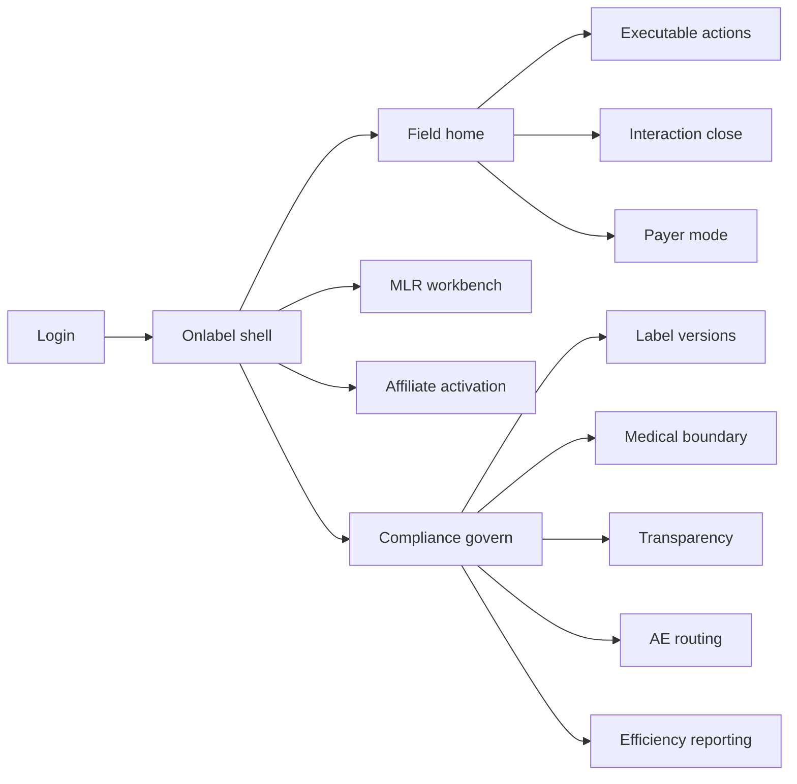
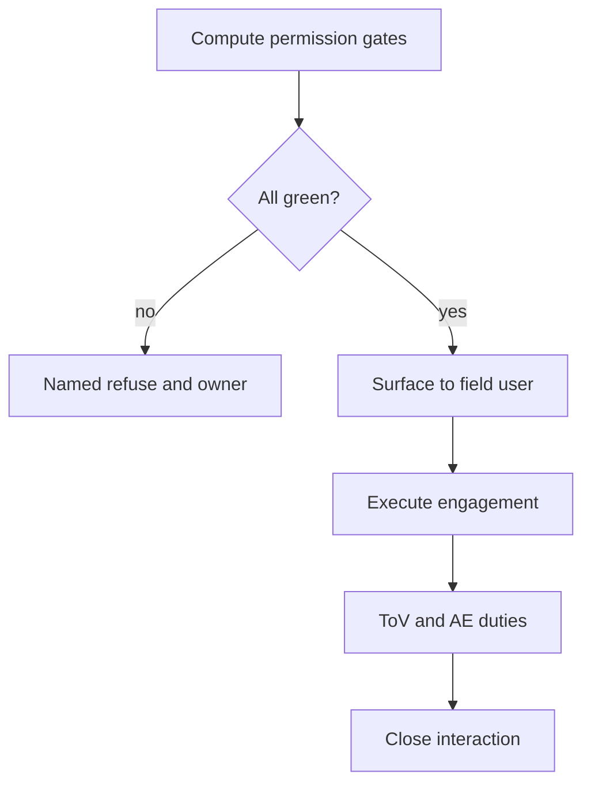

# Onlabel — Web app

**Product:** [PRODUCT.md](./PRODUCT.md)
**Primary surface:** Compliance-gated field action console (rep + MSL + affiliate commercial shell)
**Secondary surfaces:** MLR delta-review workbench; transparency / ToV submission export; pharmacovigilance routing confirmation
**Design thesis:** Onlabel is an executability engine for life-sciences commercial actions — not a Veeva CRM clone and not a marketing automation calendar. The metaphor is a traffic light computed per jurisdiction: an action reaches a rep’s queue only when label version, approved asset, claim set, engagement mode, HCP consent, and transparency duty are all currently valid; otherwise it refuses with a named unblock owner. Visual language is label-white and on-label green on cool regulatory blue-grey — off-label attempts never soft-fail; medical and commercial sit behind a hard read boundary. The Onlabel wordmark marks every action card so “next best” always means “currently permitted.”

## UX research synthesis

### Category peers (best-in-class)

- **Veeva CRM / Vault PromoMats:** Approved asset validity and expiry, MLR workflows. Steal: asset expiry withdraws queued actions same day; reject surfacing expired content with a warning-only.
- **IQVIA OCE / Salesforce Life Sciences Cloud:** HCP engagement planning. Steal: explainable targeting rationale for monitors; reject collapsing MSL and promotional modes into one NBA queue.
- **Aktana / Aigens suggestion engines:** Next-best-action for field teams. Steal: measure executed-without-rework; count point-of-use refusals against the engine; reject suggestion volume as success.
- **Transparency reporting suites (e.g. MediSpend-class):** Transfer-of-value capture. Steal: ToV at interaction close reconciled to submission; reject after-the-fact spreadsheet remediation as the happy path.

### Patterns to adopt / reject

- **Adopt:** All-gates-green or named refuse; label version withdraws assets/actions same day; medical/commercial read boundary; AE capture before close; MLR only on claim deltas; distinct payer mode; affiliate activation authority; PSP data structurally excluded from targeting.
- **Reject:** Omnichannel queue mixing MSL + promo + payer; silent drop of blocked actions; purple “AI sales coach”; patient support data as targeting fuel; blaming reps for engine refusals.

### Trust, density, and workflow constraints from PRODUCT.md

Every gate must pass with named failure reasons (BR-1). New label withdraws same day (BR-2). Medical/commercial separation evidencable (BR-3). ToV at point of interaction (BR-4). AE routing inside regulatory clock (BR-5). MLR load falls via claim reuse (BR-6). Payer mode distinct (BR-7). Affiliate activation required (BR-8). Targeting explainable; licensed data restrictions (BR-9). PSP patient data blocked (BR-10). Quality = executed without rework (BR-11). Cost per engaged HCP + asset utilisation (BR-12).

## Information architecture

### Nav model

### Roles → default home

| Role | Default home | Why |
|------|--------------|-----|
| Field rep | Executable actions | Gates-green only (BR-1) |
| MSL | Medical exchange mode | Read boundary (BR-3) |
| Affiliate commercial lead | Affiliate activation | Market go-live authority (BR-8) |
| MLR reviewer | Delta review queue | Claim delta only (BR-6) |
| Compliance / transparency | ToV + boundary evidence | BR-3, BR-4 |
| Pharmacovigilance intake | AE routing confirmations | BR-5 |
| Brand ops | Efficiency reporting | BR-11, BR-12 |

### Cross-links to OpenAPI resources

| Nav area | OpenAPI tags / resources |
|----------|---------------------------|
| Label versions, markets | Labels |
| Role/mode permissions, consent | Permissions |
| Gated actions, refusals | Actions |
| Interaction capture, close | Interactions |
| Transfer of value | Transparency |
| Adverse events / complaints | Safety |
| Scientific exchange records | Medical |
| Value dossiers / payer mode | Payer |
| Affiliate activation, firewalls | Governance |
| Cost per HCP, utilisation, rework | Reporting |

## Screen inventory

### Field home

- **Purpose:** Show only currently executable actions for this user/brand/market; surface refusal reasons elsewhere.
- **Entry:** Rep default.
- **Layout regions:** Brand + market; executable queue; refusal inbox (named reason + unblock owner); consent/status chips.
- **Primary actions:** Open action; complete interaction; acknowledge refusal.
- **Empty / loading / error:** Empty executable with refusals explained — not a barren void.
- **BR / story ties:** BR-1, BR-11.

### Action permission inspector

- **Purpose:** Compute and display each gate: asset validity, on-label claims, mode, consent, transparency duty.
- **Entry:** From action or refusal.
- **Layout regions:** Gate checklist; fail reason; owner to unblock; jurisdiction label version.
- **Primary actions:** Route to unblock; cannot force override without governed exception.
- **Empty / loading / error:** Partial compute = action not surfaced.
- **BR / story ties:** BR-1, BR-2.

### Label and asset withdraw console

- **Purpose:** New label version auto-withdraws affected assets and queued actions same day.
- **Entry:** Labels nav; affiliate ops.
- **Layout regions:** Label version timeline; impacted assets; withdrawn action count; affiliate acknowledgement.
- **Primary actions:** Publish label; confirm withdraw; notify field.
- **Empty / loading / error:** Failed withdraw = blocking incident.
- **BR / story ties:** BR-2, BR-8.

### Interaction close

- **Purpose:** Capture ToV and AE/complaint in-flow; block close until PV routing confirmed when required.
- **Entry:** After call/digital touch.
- **Layout regions:** Engagement mode; claims/assets used; ToV fields; AE capture; PV routing confirmation.
- **Primary actions:** Submit ToV; route AE; close when duties clear.
- **Empty / loading / error:** Outstanding AE duty = cannot close.
- **BR / story ties:** BR-4, BR-5.

### MLR delta workbench

- **Purpose:** Review only when proposed message deltas from approved claim set.
- **Entry:** MLR queue.
- **Layout regions:** Diff vs approved claims; reuse library; approval; trigger only on genuine delta.
- **Primary actions:** Approve; reject; map claim-to-reference.
- **Empty / loading / error:** Empty = healthy reuse rate visible.
- **BR / story ties:** BR-6.

### Medical vs commercial boundary

- **Purpose:** Enforce and evidence that scientific-exchange records do not inform promotional targeting.
- **Entry:** Compliance govern.
- **Layout regions:** Read-boundary monitor; attempted cross-use logs; export for external monitor.
- **Primary actions:** Investigate attempt; export evidence.
- **Empty / loading / error:** Attempt blocked + logged (not quiet filter).
- **BR / story ties:** BR-3.

### Payer / health-system mode

- **Purpose:** Distinct engagement with economic evidence/value dossiers — not promo claims.
- **Entry:** Field mode switch (role-permitted).
- **Layout regions:** Approved value content; outcome measures; separate approval path.
- **Primary actions:** Execute payer action; log committed outcome measure.
- **Empty / loading / error:** Promo assets unavailable in this mode.
- **BR / story ties:** BR-7.

### Affiliate activation

- **Purpose:** Local lead must approve global assets before market live.
- **Entry:** Affiliate default.
- **Layout regions:** Pending global assets; market approval record; activation authority.
- **Primary actions:** Activate; defer; reject for local label mismatch.
- **Empty / loading / error:** Unactivated global asset cannot reach field.
- **BR / story ties:** BR-8.

### Targeting rationale viewer

- **Purpose:** Explain why this HCP, message, now — honour licensed data restrictions; block PSP patient-level use.
- **Entry:** From action; compliance audit.
- **Layout regions:** Business-term rationale; data sources; PSP firewall control events.
- **Primary actions:** Export for monitor; open control event.
- **Empty / loading / error:** PSP access attempt = blocked control event (BR-10).
- **BR / story ties:** BR-9, BR-10.

### Efficiency reporting

- **Purpose:** Share of actions executed without compliance rework; marketing cost per engaged HCP; approved-asset utilisation.
- **Entry:** Brand ops.
- **Layout regions:** Rework rate (refusals charged to engine); cost per HCP; utilisation by market.
- **Primary actions:** Export; drill to refusal reasons.
- **Empty / loading / error:** Incomplete cost inputs flagged.
- **BR / story ties:** BR-11, BR-12.

## Key flows

1. **Gate action to field** — compute gates → all pass → surface action → execute → close with ToV/AE duties; failure: named refuse → unblock owner.

2. **Label publish withdraw** — new label → withdraw assets/actions same day → affiliate ack → field queue updates.

3. **AE in interaction** — mention captured → route PV → confirm within clock → then allow close.

4. **MLR delta-only** — proposed message → diff claims → no delta = reuse; delta = review queue.

5. **PSP firewall** — targeting attempt using patient support data → block + control log → never silent filter.

## Design system

### Tokens (CSS variables)

- `--color-ink: #15202B` — primary text
- `--color-reggrey: #E6EAF0` — app ground
- `--color-panel: #FFFFFF`
- `--color-labelwhite: #F8FAFC` — action cards
- `--color-onlabel: #1B7F5A` — gates green / executable
- `--color-refuse: #B3261E` — gate fail
- `--color-mlr: #9A6B12` — pending MLR delta
- `--color-medical: #2F4F7A` — medical mode chrome (bounded)
- `--color-brand: #1A3350` — Onlabel wordmark
- `--font-display: "DM Sans", sans-serif` — action titles and gate status
- `--font-body: "IBM Plex Sans", sans-serif`
- `--font-mono: "IBM Plex Mono", monospace` — label versions, asset ids, ToV refs
- `--space-1`…`--space-8`: 4px scale
- `--radius-sm: 4px`; `--radius-md: 8px`
- `--motion-gate: 160ms ease-out` — gate flip
- `--motion-withdraw: 200ms ease-in-out` — asset withdraw
- `--motion-refuse: 150ms ease-out` — refusal appear
- Atmosphere: clean regulatory paper; no consumer pharma lifestyle heroes in the field console.

### Typography & brand

- Display for executable vs refused counts; body for rationales; mono for label/asset ids.
- Brand on field home and every action card header.
- Login: brand-first; headline (“Only what is permitted today”); one CTA.

### Do / don’t

- **Do:** Named refuses; same-day withdraw; separate modes; ToV/AE in-flow; charge refusals to the engine.
- **Don’t:** Mix MSL into promo NBA; soft-warn expired assets; purple sales AI; use PSP data for targeting.

### Accessibility & domain trust cues

- AA+; gate fails text + icon.
- Live regions for withdraw and AE clock.
- Focus order on close: AE → ToV → submit.
- Medical records never appear in promo targeting inspectors.

## Component patterns

- **GateChecklist** — asset, label, mode, consent, transparency.
- **NamedRefuse** — reason + unblock owner.
- **LabelWithdrawBanner** — same-day impact count.
- **ToVCaptureForm** — recipient, amount, category, jurisdiction.
- **AeRoutingLock** — blocks interaction close.
- **ClaimDeltaDiff** — MLR trigger.
- **ModeSwitch** — promo / medical / payer with hard boundaries.
- **PspFirewallEvent** — blocked targeting attempt log.

## Out of scope for v1 web

- Building content DAM from scratch; full HR for field force; patient hub case management (separate product); consumer brand sites; global finance ERP; training the suggestion model UI.
